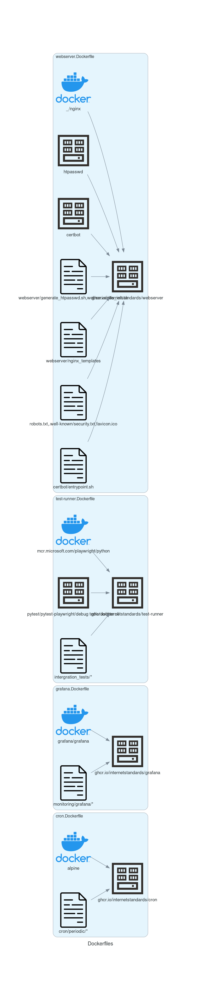

## Dockerfiles/images

The Internet.nl application stack is packaged using Docker images. This includes the application components (app, worker, beat) and all dependencies (nginx, postgres, redis, rabbitmq, routinator, unbound, grafana, prometheus and exporters).

The following images are pulled directly from Docker Hub:

  - redis
  - postgres
  - nlnetlabs/routinator
  - prometheuscommunity/postgres-exporter
  - oliver006/redis_exporter
  - prom/statsd-exporter
  - aequitas/celery-exporter

The following images use a minimal Dockerfile (see eg: `docker/webserver.Dockerfile`) to add some configuration files  (from the `docker/` directory) or settings into the image:

  - ghcr.io/internetstandards/webserver
  - ghcr.io/internetstandards/rabbitmq
  - ghcr.io/internetstandards/grafana
  - ghcr.io/internetstandards/prometheus
  - ghcr.io/internetstandards/grafana

The following images are build from the sources in this repository using the `docker/Dockerfile`:

  - ghcr.io/internetstandards/internet.nl (used by app, worker and beat)
  - ghcr.io/internetstandards/unbound (custom build unbound server)
  - ghcr.io/internetstandards/linttest (development tooling)

Images are build by Github Actions CI and pushed to the Github Registry. They can be found at: https://github.com/orgs/internetstandards/packages

Overview of additional Dockerfiles:

Overview of input and outputs of the primary Dockerfile:

## Docker Compose files

This project uses Docker Compose to configure/orchestrate it's containers/services. There is one Compose file for the application stack and some additional ones for development purposes.

### Main compose file

The `docker/compose.yaml` file contains the entire application stack configuration including all dependencies and the metrics collection stack. This file is used to deploy the application in production environments (see [Deployment](Docker-deployment.md)). All runtime configuration is fed in through environment variables (see [Environment variables and files](Docker-architecture.md#environment-variables-and-files)) below.

### Test/Development  environments

There test and develop environment each use a compose file which layered on top of the main compose file.

The `docker/compose.integration-test.yaml` file is used to create an isolated network and adds mock targets and a mock-resolver used for testing. As well as the `test-runner` service which acts inside the isolated network and performs tests against the application instance. For more information see: [Integration tests](Docker-integration-tests.md).

The `docker/compose.development.yaml` file enables mounted volumes for the source files of the app, worker and beat services, see: [Development Environment](Docker-development-environment.md).

The `docker/compose.test-runner-develop.yaml` file contains a test-runner that is configured to test against a running development environment, see: [Development environment tests](Docker-development-environment.md#development-environment-tests).

### Development tools

All development related tasks are performed inside of Docker containers (eg: unit tests, lint checking, rebuilding `requirements.txt` files, etc). For these purposes the `docker/compose.tools.yaml` and `docker/compose.test.yaml` exist.

### Live tests

The `docker/compose.test-runner-live.yaml` file allows to run live tests with IPv6 enabled against a target on the public internet. See: [Live tests](Docker-live-tests.md) and [Development environment#IPv6 support](Docker-development-environment.md#ipv6-support).

## Environment variables and files

The Internet.nl application stack is configured via environment variables passed to Docker Compose. These variables are read by the `settings.py` file or `entrypoint.sh` files to setup the runtime parameters for the various application components.

### Layered environment variable files

Variables are defined in the `docker/*.env` files. These files are layered depending on the environment being run/deployed to. This makes it easy to see differences in configuration and provides a way to separate application, environment and host specific settings.

Some variables are hardcoded in the Compose files.

**notice**: for a variable to be passed through into the containers they must be listed with just the variable name in the `environment` section of the Compose service! (see https://docs.docker.com/compose/environment-variables/set-environment-variables/#use-the-environment-attribute)

#### Defaults

All environments and deployments use the `docker/defaults.env` file as basis. This file contains basic sane settings for a production deployment. It is discouraged to modify the variables in the file unless when added new variables or setting new global defaults.

#### Development/integration test

For the development and integration test environments the `docker/defaults.env` is overlaid with the `develop.env` and `test.env` files respectively. These two files contain the specific settings required for running those environments. The same files are used in the Github Actions CI environment. These files should also not be modified unless when added new variables.

Optionally the `docker/local.env` file can be created which contains overrides for user preferences or temporary settings used in debugging and development.

The GNU Make tooling will automatically layer the correct files depending on the target executed and selected environment.

#### Deployment

For deployments the `docker/defaults.env` is overlayed with a `docker/host.env` file. This file contains host specific settings like IP addresses and domain names. The `host-dist.env` file is used during initial setup to create this file with variable interpolation. See [Deployment#application-setup](Docker-deployment.md#application-setup).

Optionally the `docker/local.env` file can be created which contains overrides for deployment specific settings which are not host specific. This makes it easier to communicate application settings from development teams to operations because a complete file can be sent instead of having to manually diff or modify existing files.

### Shell environment variables

Shell environment variables always take precedence over the file variables. This can have unexpected consequences if there are variables exported which match the variable names used in this project (eg: the `DEBUG` variable).

Using shell variables is also a way to inject variable values in an ephemeral way. For example if you want to specify the key to be used for DNSSEC signing but don't want it stored on disk you can prefix the `docker compose up` command the variable name and value and a space character (so it's not stored in Shell history). See [Deployment](Docker-deployment.md).

## Stateful data

The Internet.nl application stack is developed to be as stateless as possible. All containers use volumes to store stateful data such as databases, queues and caches or generated content such as signed DNS zones. So all containers can be deleted and recreated or restarted at any time without risk of data loss. The Docker volumes are stored at: `/var/lib/docker/volumes`.

## Test suites

Besides having 2 environments (`test`, `develop`), see: [Getting started#Different environments](Docker-getting-started.md#different-environments), there are also 4 types of test suites.

|               | Django tests                                               | Integration tests                                          | Development tests                                                             | Live tests                                                                  |
|---------------|------------------------------------------------------------|------------------------------------------------------------|-------------------------------------------------------------------------------|-----------------------------------------------------------------------------|
| Purpose       | Unit tests                                                 | Integration/end-to-end tests                               | Validate development environment                                              | Validate live deployments                                                   |
| Invocation    | `make test`                                                | `make integration-tests`                                   | `make develop-tests`                                                          | `make live-tests`                                                           |
| Documentation | [Unit tests](Docker-development-environment.md#unit-tests) | [Running tests](Docker-integration-tests.md#running-tests) | [Unit tests](Docker-development-environment.md#development-environment-tests) | [Testing your installation](Docker-deployment.md#testing-your-installation) |
| Isolated      | Yes*                                                       | Yes                                                        | No                                                                            | N/A                                                                         |
| Deterministic | Yes*                                                       | Yes                                                        | No                                                                            | No                                                                          |
| Environment   | `test`                                                     | `develop`                                                  | `develop`                                                                     | N/A                                                                         |
| Location      | `tests/`, `interface/test/`, `internetnl/test/`            | `integration_tests/integration`                            | `integration_tests/develop`                                                   | `integration_tests/live`                                                    |
| CI            | Yes                                                        | Yes                                                        | Yes                                                                           | No                                                                          |

*: The Django tests should be isolated and deterministic but currently are not completely.
