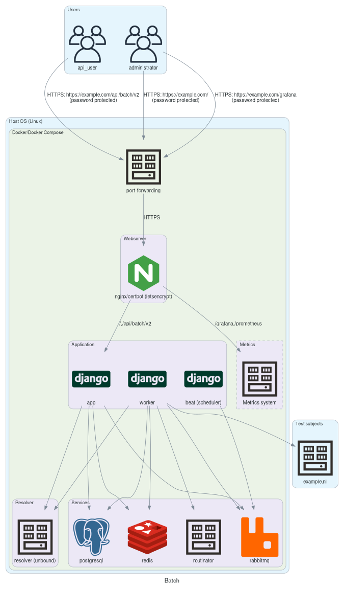

# Batch API Deployment

This document describes how to deploy and configure the Internet.nl application Batch API to run on a Linux host. This deployment does not include the "Test your connection" test and will forego the IPv6 DNS configuration found in normal deployments.

Instructions are limited to setting up the server for the functionality of the application. Security, OS maintenance and management (eg: firewall, updates, SSH) aspects are out of scope.

## Overview

The Internet.nl application stack consist of various components like: Python applications, webserver, database, queue and routinator. These components each run in their own container using Docker Compose as orchestration/deployment method. A minimal amount of changes is required on the host OS system to install and run the application.

Below is an overview of the components involved and their connections:

## Requirements

- Server running Linux (eg: Ubuntu 22.04 LTS)
- IPv4 & IPv6 address
- Domain name

The server can be hardware or VM. Minimum is at least 2 cores, 4GB memory and 50GB storage. Recommended 4 cores, 8GB memory 100GB storage. Recommended OS is Ubuntu 22.04 LTS, but any recent Debian/Ubuntu should suffice. Other OS's may be supported but not tested or documented. You should have `root` access to the server.

A fixed public IPv4 address is required. The address must be assigned to the server network primary interface. For example: `192.0.2.1`.

A fixed public routed IPv6 address is required. The address must be assigned to the server network primary interface. For example: `2001:db8:abcd:1234::1/64`.

IPv4 and IPv6 traffic may be firewalled. Outgoing traffic should not be filtered. For incoming traffic related packets should be accepted. Incoming traffic on port `80` and `443` can be IP filtered for additional access control.

Host based firewalling can be setup. But keep in mind that Docker manages port forwarding in the `nat` table, effectively 'bypassing' a firewall in the `filter` table. This is only a concern if you want to restrict access to the ports that the application exposes (`80`, `443`, `53`). For other ports (eg: `22`) you can apply firewall rules as usual, with eg: UFW.

A domain name is recommended to access the server and have Letsencrypt TLS be setup automatically. Though just a hostname or IP will work as well, but is not covered in this documentation.

## Server setup

After installation and basic configuration of the OS switch to `root` user.

Run the following command to install required dependencies:

    apt update
    apt install -yqq ca-certificates curl gnupg

Setup Docker Apt repository:

    install -m 0755 -d /etc/apt/keyrings
    curl -fsSL https://download.docker.com/linux/ubuntu/gpg | gpg --dearmor -o /etc/apt/keyrings/docker.gpg
    chmod a+r /etc/apt/keyrings/docker.gpg
    echo "deb [arch="$(dpkg --print-architecture)" signed-by=/etc/apt/keyrings/docker.gpg] https://download.docker.com/linux/ubuntu \
      "$(. /etc/os-release && echo "$VERSION_CODENAME")" stable" > /etc/apt/sources.list.d/docker.list
    apt update

Install Docker:

    apt install -yqq docker-ce docker-ce-cli containerd.io docker-buildx-plugin docker-compose-plugin

Configure Docker for IPv6 and Live restore:

    echo '{"experimental": true, "ip6tables": true, "live-restore": true}' > /etc/docker/daemon.json
    systemctl stop docker
    systemctl start docker

## Application setup

The application deployment configuration consists of a Docker Compose file (`docker-compose.yml`) and layered environment files (`docker/defaults.env`, `docker/host.env` and `docker/local.env`).

Run the following commands to install the files in the expected location:

    RELEASE=main && \
    mkdir -p /opt/Internet.nl/docker && \
    cd /opt/Internet.nl/ && \
    curl -sSfO --output-dir docker https://raw.githubusercontent.com/internetstandards/Internet.nl/${RELEASE}/docker/defaults.env && \
    curl -sSfO --output-dir docker https://raw.githubusercontent.com/internetstandards/Internet.nl/${RELEASE}/docker/host-dist.env && \
    curl -sSfO --output-dir docker https://raw.githubusercontent.com/internetstandards/Internet.nl/${RELEASE}/docker/docker-compose.yml && \
    curl -sSfO https://raw.githubusercontent.com/internetstandards/Internet.nl/${RELEASE}/docker/batch_user.sh && \
    chmod 755 batch_user.sh && \
    touch docker/local.env

To create the `docker/host.env` configuration file, the following input is required:

- `INTERNETNL_DOMAINNAME`:

  Public domain name of the application (eg: `example.com`).

  This is used as domain to visit the application, it should resolve to the server IP(v6) address. Should be a public resolvable address to enable Letsencrypt HTTPS certificate.

Use the value determined above to fill in the variables below and run the following command (protip: use ctrl-x ctrl-e in Bash to open a text editor to easily paste and edit the command):

The `IPV4_IP_PUBLIC` and `IPV6_IP_PUBLIC` must be configured to localhost addresses to disable the connection test DNS server which is not used in this setup.

    INTERNETNL_DOMAINNAME=example.com \
    IPV4_IP_PUBLIC=127.0.0.1 \
    IPV6_IP_PUBLIC=::1 \
    envsubst < docker/host-dist.env > docker/host.env

After this a `docker/host.env` file is created. This file is host specific and should not have to be modified unless something changes in the domainname settings. For batch, you may want to set `INTERNETNL_CACHE_TTL` to e.g. an hour, particularly to avoid frequent tests on common mailserver.

For instance specific configuration use the `docker/local.env` file. Please refer to the `docker/defaults.env` file which contains all configurable settings. Please **do not** modify the `docker/defaults.env` file itself as it will be overwritten in updates.

Batch installations require the following settings:

- `ENABLE_BATCH`: Must be set to `True`, to enable batch API
- `ENABLE_HOF`: Must be set to `False`, to disable Hall of Fame processing

And optionally:

- `MONITORING_AUTH_RAW`: May be a comma separated list of `user:hashed-password` pairs which are allowed to access the metrics at `https://example.com/grafana/`.
- `BASIC_AUTH_RAW` and `ALLOW_LIST`: Can be set to restrict access to the single scan webpage. See [Restricting Access](Docker-deployment.md#restricting-access) for more information.

For example:

    cat >> docker/local.env <<EOF
    ENABLE_BATCH=True
    ENABLE_HOF=False
    # user/password(s) for access to /grafana monitoring
    MONITORING_AUTH_RAW=user:<htpasswd hash>
    # user/password(s) for access to web interface
    BASIC_AUTH_RAW=user:<htpasswd hash>
    # allowed IP's to visit web interface without password
    ALLOW_LIST=198.51.100.1,2001:db8:2::1
    EOF

After configuration, spin up the instance:

    env -i RELEASE=main docker compose --env-file=docker/defaults.env --env-file=docker/host.env --env-file=docker/local.env up --wait --no-build

This command should complete without an error, indicating the application stack is up and running healthy.

Create database indexes:

    docker compose --project-name=internetnl-prod exec app ./manage.py api_create_db_indexes

## DNS setup

See the [Docker DNS setup](Docker-DNS.md).

## Managing users

To manage users, call the `/opt/Internet.nl/docker/batch_user.sh` script. This takes two arguments: an operation
and a username. The operation can be `add_update` to add or update a user's password, `delete` to delete a user,
and `verify` to verify a user's existence and password. Passwords are entered interactively.

If you would like users on the host to manage batch users, set sudo access for this script. 

## Testing your installation

After deployment you can visit the website on eg: `https://example.com` and perform single tests or use the Batch API at `https://example.com/api/batch/v2/` for Batch tests. API specification can be found at: `https://example.com/api/batch/openapi.yaml`.

You can also use the Live test suite to perform automated tests for the Batch API. For this run the following command from the deployed machine or anywhere else with Docker (replacing `APP_URLS` and `BATCH_API_AUTH` values with those determined above):

    APP_URL=https://example.com && \
    BATCH_API_AUTH=user:welkom01 && \
    docker pull ghcr.io/internetstandards/test-runner && \
    docker run -ti --rm --env=APP_URLS=$APP_URL --env=BATCH_API_AUTH=$BATCH_API_AUTH ghcr.io/internetstandards/test-runner integration_tests/live/test_batch.py

For more information see: [documentation/Docker-live-tests.md](Docker-live-tests.md)

## Further reading

Please refer the section [Deployment#Logging](Docker-deployment.md#logging) and the sections below that for more information about logging, troubleshooting, updating, access restriction, backups, migration, etc.
