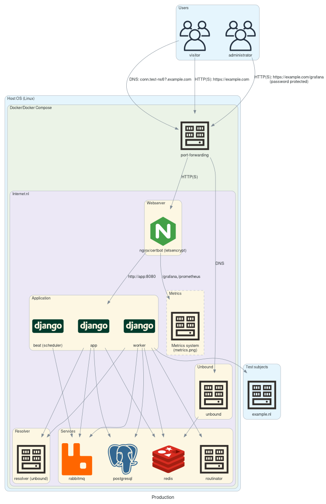

# Deployment

This document describes how to deploy and configure the Internet.nl application to run on a Linux server. This installation includes all 3 tests (Wesite, Email, Connection) and IPv6 but not Batch mode. If this is not applicable to your situation please refer to other deployment documents ([Deployment Batch](Docker-deployment-batch.md)).

Instructions are limited to setting up the server for the functionality of the application. Security, OS maintenance and management (eg: firewall, updates, SSH) aspects are out of scope.

## Overview

The Internet.nl application stack consist of various components like: Python applications, webserver, database, queue and routinator. These components each run in their own container using Docker Compose as orchestration/deployment method. A minimal amount of changes is required on the host OS system to install and run the application.

Below is an overview of the components involved and their connections:

## Requirements

- Server running Linux (eg: Ubuntu 22.04 LTS)
- Public IPv4 address
- Public IPv6 address
- Public domain name

The server can be hardware or VM. Minimum is at least 2 cores, 4GB memory and 50GB storage. Recommended 4 cores, 8GB memory 100GB storage. Recommended OS is Ubuntu 22.04 LTS, but any recent Debian/Ubuntu should suffice. Other OS's may be supported but not tested or documented. You should have `root` access to the server.

A fixed public IPv4 and IPv6 address are required. These addresses should be bound to the server's network interface. For example: `192.0.2.1` and `2001:db8:1::1`.

IPv4 and IPv6 traffic may be firewalled but should always maintain the source address of the connection to the server. Outgoing traffic should not be filtered. For incoming traffic related packets and the following ports should be accepted on both IPv4 and IPv6:

- 80/tcp
- 443/tcp
- 53/tcp
- 53/udp

Host based firewalling can be setup. But keep in mind that Docker manages port forwarding in the `nat` table, effectively 'bypassing' a firewall in the `filter` table. This is only a concern if you want to restrict access to the ports that the application exposes (`80`, `443`, `53`). For other ports (eg: `22`) you can apply firewall rules as usual, with eg: UFW.

A public domain name or subdomain is required. It should be possible to set the `A`, `AAAA`, `CNAME`, `NS` and `DS` records on the (sub)domain.

## Server setup

After installation and basic configuration of the OS switch to `root` user.

Run the following command to install required dependencies, setup Docker Apt repository, and install Docker:

    apt update && \
    apt install -yqq ca-certificates curl gnupg && \
    install -m 0755 -d /etc/apt/keyrings && \
    curl -fsSL https://download.docker.com/linux/ubuntu/gpg | gpg --dearmor -o /etc/apt/keyrings/docker.gpg && \
    chmod a+r /etc/apt/keyrings/docker.gpg && \
    echo "deb [arch="$(dpkg --print-architecture)" signed-by=/etc/apt/keyrings/docker.gpg] https://download.docker.com/linux/ubuntu \
      "$(. /etc/os-release && echo "$VERSION_CODENAME")" stable" > /etc/apt/sources.list.d/docker.list && \
    apt update && \
    apt install -yqq docker-ce docker-ce-cli containerd.io docker-buildx-plugin docker-compose-plugin

Configure Docker for IPv6 and Live restore:

    echo '{"experimental": true, "ip6tables": true, "live-restore": true}' > /etc/docker/daemon.json && \
    systemctl stop docker && \
    systemctl start docker

## Application setup

The application deployment configuration consists of a Docker Compose file (`docker-compose.yml`) and layered environment files (`docker/defaults.env`, `docker/host.env` and `docker/local.env`).

Run the following commands to install the files in the expected location:

    RELEASE=main
    mkdir -p /opt/Internet.nl/docker && \
    cd /opt/Internet.nl/ && \
    curl -sSfO --output-dir docker https://raw.githubusercontent.com/internetstandards/Internet.nl/${RELEASE}/docker/defaults.env && \
    curl -sSfO --output-dir docker https://raw.githubusercontent.com/internetstandards/Internet.nl/${RELEASE}/docker/host-dist.env && \
    curl -sSfO --output-dir docker https://raw.githubusercontent.com/internetstandards/Internet.nl/${RELEASE}/docker/docker-compose.yml && \
    touch docker/local.env

To create the `docker/host.env` configuration file, the following inputs are required:

- `INTERNETNL_DOMAINNAME`:

  Public domain name of the application (eg: `example.com`).

  This is used as domain to visit the application and as domain for the connection test subdomains.

- `IPV4_IP_PUBLIC`:

  Public IPv4 address (eg: `192.0.2.1`)

  This is the address by which the website and Unbound DNS is accessible over IPv4 on public internet.

  To determine the current IPv4 address you can use: `ip -4 addr show dev eth0` or `curl -4 ifconfig.io`.

- `IPV6_IP_PUBLIC`:

  Public IPv4 address (eg: `2001:db8:1::1`)

  This is the address by which the website and Unbound DNS is accessible over IPv6 on public internet.

  To determine the current IPv4 address you can use: `ip -6 addr show dev eth0` or `curl -6 ifconfig.io`.

All IPv6 addresses must be in condensed form, i.e. `2001:db8:1::1` and not `2001:db8:0000:0000:0000:0000:0000:1`.

Use the values determined above to fill in the variables below and run the following command (protip: use ctrl-x ctrl-e in Bash to open a text editor to easily paste and edit the command):

    INTERNETNL_DOMAINNAME=example.com \
    IPV4_IP_PUBLIC=192.0.2.1 \
    IPV6_IP_PUBLIC=2001:db8:1::1 \
    envsubst < docker/host-dist.env > docker/host.env

After this a `docker/host.env` file is created. This file is host specific and should not be modified unless something changes in the domainname or IP settings.

For instance specific configuration use the `docker/local.env` file. Please refer to the `docker/defaults.env` file which contains all configurable settings. Please **do not** modify the `docker/defaults.env` file itself as it will be overwritten in updates.

Spin up instance:

    env -i RELEASE=main docker compose --env-file=docker/defaults.env --env-file=docker/host.env --env-file=docker/local.env up --wait --no-build

The `env -i` part is to ensure no environment variables that might be set in the shell overwrite values from the `.env` files (eg: the `DEBUG` variable).

This command will take a long time (up to 30 minutes) due to RPKI data that needs to be synced initially. After that it should complete without an error, indicating the application stack is up and running healthy. You can already prepare continue with the DNS setup below in the meantime.

## DNS setup

For accessing the absolute minimum basic functionality of the application the following DNS records must be configured:

    example.com                    A      192.0.2.1
                                   AAAA   2001:db8:1::1

The following extra records must be configured for language switching and IPv6 only hostname:

    www.example.com                CNAME  example.com
    nl.example.com                 CNAME  example.com
    en.example.com                 CNAME  example.com

    ipv6.example.com               AAAA   2001:db8:1::1
    www.ipv6.example.com           CNAME  ipv6.example.com
    nl.ipv6.example.com            CNAME  ipv6.example.com
    en.ipv6.example.com            CNAME  ipv6.example.com

For the "Test your connection" test the following records are required:

    conn.example.com               CNAME  example.com
    en.conn.example.com            CNAME  example.com
    nl.conn.example.com            CNAME  example.com
    www.conn.example.com           CNAME  example.com

    conn.ipv6.example.com          CNAME  ipv6.example.com
    nl.conn.ipv6.example.com       CNAME  ipv6.example.com
    en.conn.ipv6.example.com       CNAME  ipv6.example.com
    www.conn.ipv6.example.com      CNAME  ipv6.example.com

    test-ns-signed.example.com     NS     ns.test-ns-signed.example.com
    ns.test-ns-signed.example.com  A      192.0.2.1
                                   AAAA   2001:db8:1::1001

    test-ns6-signed.example.com    NS     ns.test-ns6-signed.example.com
    ns.test-ns6-signed.example.com AAAA   2001:db8:1::1001

For connectin test two signed DNS zones are created and served by the application using Unbound. For this to work properly the delegating zone must also serve the correct `DS` records.

Obtain the `DS` records by inspecting the logs of the `unbound` service and finding the 2 lines beneath `Please add the following DS records for domain`:

    $ docker logs internetnl-prod-unbound-1 2>&1 | grep -A2 "Please add the following DS records for domain"
    Please add the following DS records for domain example.com:
    test-ns-signed.example.com.   IN  DS  55295 8 2 aaaaaaaaaaaaaaaaaaaaaaaaaaaaaaaaaaaaaaaaaaaaaaaaaaaaaaaaaaaaaaaa
    test-ns6-signed.example.com.  IN  DS  33292 8 2 aaaaaaaaaaaaaaaaaaaaaaaaaaaaaaaaaaaaaaaaaaaaaaaaaaaaaaaaaaaaaaaa

Configure these two DS records:

    test-ns-signed.example.com.   IN  DS  55295 8 2 aaaaaaaaaaaaaaaaaaaaaaaaaaaaaaaaaaaaaaaaaaaaaaaaaaaaaaaaaaaaaaaa
    test-ns6-signed.example.com.  IN  DS  33292 8 2 aaaaaaaaaaaaaaaaaaaaaaaaaaaaaaaaaaaaaaaaaaaaaaaaaaaaaaaaaaaaaaaa

You can verify DNSSEC using:

  - https://dnsviz.net/d/test.a.conn.test-ns-signed.example.com/dnssec/
  - https://dnsviz.net/d/test.aaaa.conn.test-ns-signed.example.com/dnssec/

## Testing your installation

After deployment is complete, all services are healthy and DNS is setup you can visit the website on eg: `https://example.com` and perform tests manually. Or use the Live test suite to perform automated tests. For this run the following command from the deployed machine or anywhere else with Docker:

    APP_URL=https://example.com
    docker pull ghcr.io/internetstandards/test-runner && \
    docker run -ti --rm --env=APP_URLS=$APP_URL ghcr.io/internetstandards/test-runner

For more information see: [documentation/Docker-live-tests.md](Docker-live-tests.md)

## Logging

Log output from containers can be obtained using the following command:

    env -i docker compose --project-name=internetnl-prod logs -f

Or only for specific services:

    env -i docker compose --project-name=internetnl-prod logs -f app

## Troubleshooting/mitigation

When things don't seem to be working as expected and the logs don't give clear indications of the cause the first thing to do is check the status of the running containers:

    env -i docker compose --project-name=internetnl-prod  ps -a

Containers should have a `STATUS` of `Up` and there should be no containers with `unhealthy`. The `db-migrate` service having status `Exited (0)` is expected. Containers with a short uptime (seconds/minutes) might indicate it restarted recently due to an error.

It might be possible not all containers that should be running are running. To have Docker Compose check the running instance and bring up any missing components run:

    env -i docker compose --env-file=docker/defaults.env --env-file=docker/host.env --env-file=docker/local.env up --wait --no-build

If this does not solve the issue you might want to reset the instance by bringing everything down and up again:

    env -i docker compose --project-name=internetnl-prod down
    env -i docker compose --env-file=docker/defaults.env --env-file=docker/host.env --env-file=docker/local.env up --wait --no-build

If this does not work problems might lay deeper and OS level troubleshooting might be required.

## Autohealing

Critial services/containers have Docker healthchecks configured. These run at a configured interval to verify the correct functioning of the services. If a service is unhealthy for to long the Docker daemon will restart the service.

### Known issues

#### Internal Docker DNS not working

Docker Compose relies on an internal DNS resolver to resolve container names so the services can communicate via those names (eg: webserver to app, app to PostgreSQL). The internal DNS resolver might become unavailable. This might happen if the system is resource constrained (eg: low memory) and the resolver is OOM killed. This manifests in the application/monitoring becoming unavailable (`502` errors) and logs lines like:

    2023/07/24 07:39:18 [error] 53#53: recv() failed (111: Connection refused) while resolving, resolver: 127.0.0.11:53

The issue can be resolved by restarting the application:

    env -i docker compose --project-name=internetnl-prod restart

## Updating

To update the application stack first update the `docker/defaults.env` and `docker/docker-compose.yml` files, then pull the latest versions of the prebuild images and update the application components, use the following commands:

    RELEASE=main
    cd /opt/Internet.nl/ && \
    curl -sSfO --output-dir docker https://raw.githubusercontent.com/internetstandards/Internet.nl/${RELEASE}/docker/defaults.env && \
    curl -sSfO --output-dir docker https://raw.githubusercontent.com/internetstandards/Internet.nl/${RELEASE}/docker/docker-compose.yml && \
    env -i RELEASE=$RELEASE docker compose --env-file=docker/defaults.env --env-file=docker/host.env --env-file=docker/local.env pull && \
    env -i RELEASE=$RELEASE docker compose --env-file=docker/defaults.env --env-file=docker/host.env --env-file=docker/local.env up --remove-orphans --wait --no-build

This will update the deployment with the latest `main` branch. If you want to update to a tagged version release or follow a specific development branch, adjust the value of `RELEASE` accordingly.

To update to `v1.8.0`:

    RELEASE=v1.8.0
    cd /opt/Internet.nl/ && \
    curl -sSfO --output-dir docker https://raw.githubusercontent.com/internetstandards/Internet.nl/${RELEASE}/docker/defaults.env && \
    curl -sSfO --output-dir docker https://raw.githubusercontent.com/internetstandards/Internet.nl/${RELEASE}/docker/docker-compose.yml && \
    env -i RELEASE=$RELEASE docker compose --env-file=docker/defaults.env --env-file=docker/host.env --env-file=docker/local.env pull && \
    env -i RELEASE=$RELEASE docker compose --env-file=docker/defaults.env --env-file=docker/host.env --env-file=docker/local.env up --remove-orphans --wait --no-build

To update to the latest build of the `feature-x` branch:

    RELEASE=feature-x
    cd /opt/Internet.nl/ && \
    curl -sSfO --output-dir docker https://raw.githubusercontent.com/internetstandards/Internet.nl/${RELEASE}/docker/defaults.env && \
    curl -sSfO --output-dir docker https://raw.githubusercontent.com/internetstandards/Internet.nl/${RELEASE}/docker/docker-compose.yml && \
    env -i RELEASE=$RELEASE docker compose --env-file=docker/defaults.env --env-file=docker/host.env --env-file=docker/local.env pull && \
    env -i RELEASE=$RELEASE docker compose --env-file=docker/defaults.env --env-file=docker/host.env --env-file=docker/local.env up --remove-orphans --wait --no-build

The `pull` command might sometimes fail with a timeout error. In that case just retry until it's working. Or check [Github Status](https://www.githubstatus.com) to see if Github is down again.

### Updating to specific release

https://github.com/internetstandards/Internet.nl/blob/21baea392039ede54257f729cf951d6d6e129199/docker/docker-compose.yml

## HTTPS/Letsencrypt

By default the installation will try to request a HTTPS certificate with Letsencrypt for the domain and it's subdomains. If this is not possible it will fall back to a self-signed 'localhost' certificate. If requesting a certificate fails you can debug it by viewing the logs using:

    env -i docker compose --project-name=internetnl-prod logs webserver

and

    env -i docker compose --project-name=internetnl-prod exec webserver "cat /var/log/letsencrypt/letsencrypt.log"

It may take a few minutes after starting for the Letsencrypt certificates to be registered and loaded.

## Batch API

Besides the single scan webpage, the Internet.nl application also contains a Batch API. This is disabled by default on normal installations. Please refer to [Deployment Batch](Docker-deployment-batch.md) for more information.

## Metrics (grafana/prometheus)

The default deployment includes a metrics collection system. It consists of a Prometheus metrics server with various exporters and a Grafana frontend. To view metrics and graphs visit: `https://example.com/grafana/`. Authentication is configured using the `MONITORING_AUTH` variable.

Also see: [Metrics](Docker-metrics.md)

## Monitoring/alerting

Though the metrics collection system described above can be used for monitoring on the application level it is not suited for alerting or monitoring when the system is under cricital load, due to it running within the same Docker environment.

For the best reliability it is advised to setup monitoring checks external to the server to verify the health of the application components. Because this is very specific to the environment in which the server is running we can only provide generic instructions on what to monitoring.

Basic system checks:

- CPU
- memory/swap
- free disk space on `/var`

All stateful data resides in persistent Docker volumes under `/var/lib/docker/volumes`, a large amount of non-stateful data (ie: images/container volumes) is stored under `/var/lib/docker`.

- Docker daemon status

Because the entire application runs in the Docker container engine it should be monitored for running status. For this check the systemd state of the `docker` unit with for example:

	systemctl is-active docker

This will return a 0 exit code if everything is as expected. Due to Docker being configured with `live-restore`, the daemon itself being down has no direct and immediate impact on the application. But selfhealing behaviour and further interaction with the services will be unavailable.

- Critital application services/containers status

All services/containers critical to the application's primary functionality have a Docker healthcheck configured. This will run at an configured interval to verify the proper operation of the service.

To verify the health status of the critial services use these commands:

	docker inspect --format='{{.State.Health.Status}}' internetnl-prod-webserver-1|grep -qw healthy
	docker inspect --format='{{.State.Health.Status}}' internetnl-prod-app-1|grep -qw healthy
	docker inspect --format='{{.State.Health.Status}}' internetnl-prod-worker-1|grep -qw healthy
	docker inspect --format='{{.State.Health.Status}}' internetnl-prod-beat-1|grep -qw healthy
	docker inspect --format='{{.State.Health.Status}}' internetnl-prod-postgres-1|grep -qw healthy
	docker inspect --format='{{.State.Health.Status}}' internetnl-prod-redis-1|grep -qw healthy
	docker inspect --format='{{.State.Health.Status}}' internetnl-prod-rabbitmq-1|grep -qw healthy
	docker inspect --format='{{.State.Health.Status}}' internetnl-prod-unbound-1|grep -qw healthy
	docker inspect --format='{{.State.Health.Status}}' internetnl-prod-routinator-1|grep -qw healthy
	docker inspect --format='{{.State.Health.Status}}' internetnl-prod-resolver-permissive-1|grep -qw healthy
	docker inspect --format='{{.State.Health.Status}}' internetnl-prod-resolver-validating-1|grep -qw healthy

The services `webserver`, `app`, `postgres` and `redis` are critical for the user facing HTTP frontend, no page will show if these are not running. The services `worker`, `rabbitmq`, `routinator`, `unbound`, `resolver-permissive` and `resolver-validating` are additionally required for new tests to be performed. The `beat` service is required for updating hall-of-fame. For Batch Deployment this is however a critical service to schedule batch tests submitted via the API.

## Restricting access

By default the installation is open to everyone. If you like to restrict access you can do so by either using HTTP Basic Authentication or IP allow/deny lists.

### HTTP Basic Authentication

Site wide HTTP Basic Authentication is configured `BASIC_AUTH` and `BASIC_AUTH_RAW` variable. They should contain comma separated `user:password` or `user:encrypted_password` entries.

The allow only the user `example_user` with password `secret123` to access the site add the following in the `docker/local.env` file:

    BASIC_AUTH=example_user:secret123

Aditionally the password can already be provided as encrypted value. For this encrypt the password using the `htpasswd` tool and use the `BASIC_AUTH_RAW` variable. Make sure to enclose the value with single quotes:

    BASIC_AUTH_RAW='example_user:$apr1$trHqgfkY$tIpKCOuSHLfYa20HVzyaX.'

Both variables can be used at the same time.

### IP allow/deny lists

Site wide IP(v6) allow lists can be configured by specifying the `ALLOW_LIST` variable. It should contain a comma separated list of IP(v6) addresses or subnets.

For example, to only allow the IP addresses `198.51.100.1` and `2001:db8:2::1` access add the following in the `docker/local.env` file:

    ALLOW_LIST="198.51.100.1,2001:db8:2::1"

### Combining HTTP Basic Authentication and IP allow lists

When setting boat `BASIC_AUTH(_RAW)` and `ALLOW_LIST`, users connecting from an IP in the allow list won't be prompted for a password.

## Renewing DNSSEC after IP/hostname change

After changing the IP or hostname in the `docker/host.env` file run:

    env -i docker compose --env-file=docker/defaults.env --env-file=docker/host.env --env-file=docker/local.env up --wait --no-build

to update the DNSSEC accordingly.

When the hostname is changed, update upstream DNSSEC keys with the new values from:

    docker logs internetnl-prod-unbound-1 2>&1 | grep -A2 "Please add the following DS records for domain"

## State/backups/restores/migration

All stateful date for the application stack is stored in Docker Volumes. For backup and DR purposes make sure to include all `/var/lib/docker/volumes/internetnl_*` directories in your snapshot/backup. The directory `internetnl_routinator` can be omited as it contains a cache of externally fetched data.

When recovering or migrating to a new server first the "Server Setup" should be done then these directories should be restored, after which the "Application Setup" can be done.
