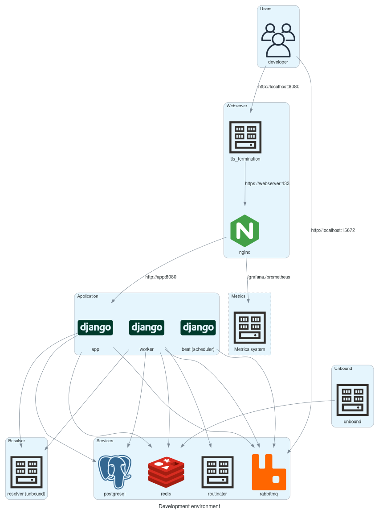

# Docker Development Environment

The Docker development environment provides a way to bring up the full Internet.nl application stack using Docker Compose. This allows to test the application against targets on the internet. However due to limitations of the Docker implemenation and host OS not all functionality will be available (eg: IPv6 or the Connection Test). For development using a TDD approach or in a simulated environment please refer to the [Integration tests](Docker-integration-tests.md) documentation.

## Overview

The Internet.nl application stack consist of various components like: Python applications, webserver, database, queue and routinator. These components each run in their own container.

As a developer you connect to the application through `http://localhost:8080/`. This will take you through the webserver to the application.

There are 3 Python applications that share a codebase.

- The `app` application runs the HTTP web interface and API. A user can start a test through the web interface, after which the `app` will do a verification of the domain and if valid puts the test on a queue on `RabbitMQ` to be executed by the `worker`. After a queued test has been executed the results are fetched back via `Redis` and stored in `PostgreSQL`.
- The `beat` application is the scheduler for recurring tasks. It takes schedule configuration from `celery.py` and puts tasks on the `RabbitMQ` queue to be exectued by the `worker`. For 'normal' installation this is only to regenerate the Hall of Fame. For 'batch' installations this application is critical to start processing batch jobs.
- The `worker` application consumes the `RabbitMQ` queues and performs the tasks and tests posted there. For tests it will either directly connect to endpoints to validate test criteria like TLS, uses an internal Unbound library for DNS or obtains information via `Routinator` for RPKI. After the test has run the result is put on `Redis` result queue.

The metrics collection system is accessible via `http://localhost:8080/grafana/`, for more information see 'Metrics' below.

## Setup

For requirements and setup of the development environment please first refer to the [Getting started](Docker-getting-started.md) document.

## Development cycle

There are multiple to iterate over changes and rebuilding/restarting the development environment depending on what kind of changes are made. Some will be quicker than others because not everything is rebuild. Others are more complete/safe as they rebuild everything but might be a little slower.

### Rebuild/restart all containers

The default way of rebuilding/restarting everything after a code change is to run the following two commands:

    make build env=develop
    make up env=develop

This is the most reliable way to rebuild and restart everything. It will first rebuild all container images that need rebuilding. Layer caching is leveraged to provide the quickest possible way to rebuild the images and skipping steps that are not needed. But when for example the requirements.txt file or a vendored source changes most of the container will be rebuild, which takes some time.

After rebuilding the images all containers who's image has changed will be restarted with the new image.

These commands can be combined into one like so:

    make build up env=develop

After build, initially setting up the environment might take a minute or 3 because RabbitMQ is slow on startup and it is a requirement for most other services. If you do not bring down the Rabbitmq service, subsequent changes (up/restart) to the development should run much quicker. The `make up` command should normally complete in under 5 seconds when no source code/configuration changes are made.

### Rebuild/restart specific container more quickly

Builds might take a few seconds to minutes to complete depending on what file/configuration changes are made. Normally a build for all images without any changes completes under 20 seconds.

It is possible to limit the build and up actions to specific services. So only the containers for those services are rebuild/restarted. To do this use the `build` and `up` target and provide the `services=` argument like so:

    make build up services=app env=develop

Using the `up-no-deps` target will restart the service without checking if it's dependencies need restarting:

    make build up-no-deps services=app env=develop

Multiple services can be specified like so:

    make build up-no-deps services="app worker" env=develop
    make build up-no-deps services="app worker beat" env=develop

**notice**: This method is quicker than rebuilding/restarting everything but may result in some changes not being picked up if files are changed who's service is not being rebuild/restarted.

Using a Docker runtime with more memory and CPU cores improves rebuild/restart speed.

### Auto reload

Once the development environment is up and running it will autotically rebuild/restart/reload when certain parts of the source code change. Currently changes to the following files will be detected and acted upon:

- Python sources in  `checks/`, `internetnl/`, `interface/`: will reload `app` and `worker*` using Django autoreload, when needed open browser sessions will reload.
- CSS files in `frontend/css/`: will rebuild CSS files and open browser sessions will reload.
- Django template files (`.html`) in `interface/templates/`: open browser sessions will reload.

### Foreground development

Instead of running in the background the application stack can also be started in foreground mode using the command:

    make develop

This convenience command will build all relevant services, start the entire stack and show log output for the most relevant services. The Docker Compose application will keep running in the foreground. Terminating it (with `ctrl-c`) will shutdown all running services and bring down the entire application stack.

#### Frontend development

When only developing on frontend parts of the application (eg: `html`, `css`, `javascript`, Django templates/views), a smaller subset of the application can be started using:

    make develop_frontend

### Running/debugging individual probes

It is possible to run individual probes with debug logging using a manage command. This provides a quick way to iterate over changes regarding test/probe code without having to go through the web interface. For this run the following command:

    docker exec -ti internetnl-develop-app-1 python3 manage.py probe --probe=web_rpki --domain=internet.nl

To find all possible values for `--probe` run the command with `--help`.

### Using source bind volumes

Most changes to only the Python source do not require the rebuilding of images, when you don't need to change any of the following:

- template/translations/staticfile/js/css
- requirements.txt files
- sources in `vendor/`
- Dockerfile/compose.yaml files

## Debugging/introspection/troubleshooting/resettings

### Container status

To get the current status of containers run:

    make ps env=develop

There should be no containers with `STATUS` of `unhealthy`.

Also verify the uptime in the `STATUS` column. If one container repeatedly has a low uptime (in the seconds) this could indicate the container is in a restart loop.

Verify container logging using:

     make logs env=develop

Or for (a) specific container(s):

    make logs services=app env=develop

### Container startup debugging

To see container logging during start first stop the containers and remove them:

    make down env=develop

Then start but in the foreground:

    make run env=develop

**notice**: using `ctrl-c` when using the run command will kill the containers.

Individual containers can be started using, eg:

    make run services=app env=develop

#### No logging during container startup

Sometimes a container will not build or start properly and no debug logging is available. This might be due to the fancy Docker Compose output obscuring logs. A workaround is to disable the fancy output and use `plain` logging. For this run the command with `compose_args=--progress=plain`, eg:

    make run compose_args=--progress=plain env=develop

### Enter container shell

To enter a container to inspect the filesystem of processes run the following command:

    make exec service=app env=develop

This will default to running Bash shell inside the service's container as the `root` user. **notice**: This might not necessarily be the user under which the container process normally runs!

You can also provide a different command like so:

    make exec service=app cmd="cat /etc/resolv.conf" env=develop

Or if Bash is not installed in the container use for example:

    make exec service=webserver cmd=sh env=develop

### Starting a container with a shell instead of the default entrypoint

Sometimes the container may not come up at all so you cannot enter a shell. Or you want to test starting the container entrypoint with different arguments. In this case you can start the container using:

    make run-shell service=app env=develop

### Resetting the development environment

There are multiple levels of resetting the environment for the fastest and most painless to the nuclear option depending on how FUBAR your development enviroment might become. In order:

#### Bring environment up

To have Docker Compose assess the missing/changed parts of your environment and restore it into the correct/updated state, run:

    make up env=develop

#### Bring environment down an up (keeping storage)

Stopping all containers and starting them might reset some state that is causing issues:

    make down up env=develop

#### Bring environment down an up (removing storage)

Additionally remove the volumes might reset some persistent state, this will cause things queues, databases, caches, etc to be cleared:

    make down-remove-volumes up env=develop

#### Resetting Docker containers/images

Sometimes Docker might be running to many containers or have to much image cache. This might especially be the case if your environment runs low on memory.

Check if there are no other container running besides the project you are working on:

    docker ps --all

Should list only `internetnl-develop-` prefixed containers in `NAMES`.

All containers (not just from this project!) can be removed using:

    docker rm --force $(docker ps --all --quiet)

And the networks:

    docker network prune --force

To also remove volumes (just for this project) run:

    docker volume rm --force $(docker volume ls --quiet|grep "internetnl-develop-")

After which the environment can be brought up again:

    make up env=develop

Sometimes Docker will not pick up on a change in the sourcecode and not rebuild a specific container image, for example when you pull in a big change from upstream. In this case you can rebuild all images fresh using:

    make build-no-cache

#### Docker factory reset

If the above is not enough: "have you tried turning it on and off again?". Reboot your system. It just might help.

Otherwise on Mac, try factory resetting Docker: https://docs.docker.com/desktop/troubleshoot/overview/

### Docker compose configuration files

Different versions of Docker Compose may have different ways of processing configuration files or the way they are merged. If you suspect there is an issue due to a newer version of Docker Compose, to see what the final configuration file looks like after merging for example `compose.yaml` and `compose.intergration-test.yaml` for the `test` environment run:

    make docker-compose-config env=test

For convenience you can store the config files in versioned files so they can be diffed, using the commands:

    make docker-compose-config-to-file env=test

### Known error messages

#### Incompatible Docker/Compose version

The following error messages indicate a Docker or Compose version which is not supported. Please refer to `documentation/Docker-getting-started.md#Prerequisites` for compatible versions.

Incompatible Compose version:

    no configuration file provided: not found

## IPv6 support

IPv6 support in the development environment is not enabled by default and must be especially configured depending on your setup. On Linux hosts it will mostly work if you have native IPv6. On Mac all Docker runtimes are implemented using Linux VM's which means some additional setup is needed which is not supported on all runtimes.

By default IPv6 is not configured. See below for the options to enable IPv6 for your specific setup/scenario.

### No IPv6

Depending on the change/feature you need to develop IPv6 might not be a requirement. For example if you only work on the frontend. In this case missing IPv6 support can be ignored.

### Integration test environment

The integration test environment contains an isolated internal IPv6 network. If the feature/change can be approached without needing to connect to an outside instance but instead using a simulated test target, this would be the way to go. Please refer to the [Integration tests](Docker-integration-tests.md) document for more information.

### Native IPv6/IPv6 tunnel

When your workstation has native IPv6 or is using a IPv6 tunnel from a provider like HE (https://tunnelbroker.net) you can enable IPv6 inside the development environment using the following steps:

#### Colima/macOS

When using the Colima Docker runtime on macOS it is possible to configure the Lima VM used by Colima to use the native IPv6 forwarded by the macOS host system.

Install Colima (version 0.5.5+) Docker runtime using [Homebrew](https://brew.sh):

    brew install colima

Enable IPv6 forwarding in macOS:

    sudo sysctl net.inet6.ip6.forwarding=1

Stop and delete potential previous Colima instance:

    colima delete default

Create new Colima instance with `shared` network (adjust `memory` to as much GB as you can spare):

    colima start --memory=4 --network-address --network-driver=slirp --arch=x86_64 --edit

This will also open an editor in which the following changes need to be applied:

Change:

    docker: {}

Into:

    docker:
      experimental: true
      ip6tables: true

Change:

    provision: []

Into:

    provision:
      - mode: system
        script: |
          cat >> /etc/sysctl.d/colima-ipv6.conf <<EOF
          net.ipv6.conf.eth0.disable_ipv6=1
          net.ipv6.conf.col0.accept_ra=2
          EOF
          sysctl -p /etc/sysctl.d/colima-ipv6.conf
          # TODO: below is a hack needed until Docker 25.0 is released, https://github.com/moby/moby/pull/45649
          ip6tables -N DOCKER-USER
          ip6tables -I DOCKER-USER --dst ff00::/8 -j ACCEPT -m comment --comment "allow neighbor discover on Docker networks with internal=true"
          ip6tables-save > /etc/iptables/rules6-save

After saving the file and closing the editor the Colima instance should be created and have native IPv6 available.

Check if the Colima instance now has IPv6 connectivity by pinging a known IPv6 address (`AAAA` is not enabled in the VM):

    colima ssh ping6 2600::

Bring a new development environment up using:

    make up env=develop

You should now have working IPv6 in your containers:

    make exec env=develop service=worker cmd='ping6 example.nl'

#### Linux only

You need to set the following options to `true` in your docker config file (`/etc/docker/daemon.json`): `experimental`, `ip6tables`, and restart the Docker daemon (`systemctl restart docker`). See also: https://docs.docker.com/config/daemon/ipv6/

If you already have a development environment instance running stop it by using:

    make down env=develop

Make sure the `internetnl-develop_internal` and `internetnl-develop_public-internet` are also deleted (check with `docker network ls`).

Bring the development environment back up using: `make up env=develop`

You should now have working IPv6 in your containers: `make exec env=develop service=worker cmd='ping6 example.nl'`.

### Remote development / VM

If you have access to a remote Linux machine with native IPv6 or are able to setup a local VM with IPv6 support this can be used for remote development. Please also see the [Deployment](Docker-deployment.md) document for more information and how to setup DNS for the connection tests.

### Linting and code quality checks

To run linting and code quality checks use the following command:

    make lint env=develop

To check non code issues (eg: requirements file discrepancy) use:

    make checks env=develop

To automatically fix trivial linting issues run:

    make fix env=develop

### Development environment tests

The development environment contains a test suite which is similar to the integration test suite, in that it simulated an external browser to run tests against the frontend of the application. This test suite however is not as complete as the integration test one and is only to provide rudamentary tests to ensure the development environment itself is working as expected. To run this test suite use:

    make develop-test env-develop

### Unit tests

Unit tests are located in the `tests/` directory or `test` directories in the Django application directories `checks`, `interface` and `internetnl`.

To run tests in the locations use the following command:

    make test

Or to run a single test:

    make test test_args=-kname_of_the_test

It is also possible to enter the container used for the tests and run pytest directly. This way you can skip on the container setup every time you iterate:

    make test-shell
    pytest -vvv -ra internetnl tests interface checks integration_tests --ignore-glob='integration_tests/*'

For more information about how to invoke the test command see: [Integration Tests#tips-and-tricks](https://github.com/internetstandards/Internet.nl/blob/docker/documentation/Docker-integration-tests.md#tips-and-tricks)

## Metrics (grafana/prometheus)

The development environment includes the same metrics collection as used on the production environment. It consists of a Prometheus metrics server with various exporters and a Grafana frontend. To view metrics and graphs visit: `http://localhost:8080/grafana/` with user and password being `test`.

Also see: [Metrics](Docker-metrics.md)

## Versioning

During development the version will always be `0.0.0-dev`. This is to prevent dynamic versions to impact (re)build speed.

## DB Migrations

This project uses [Django Migrations](https://docs.djangoproject.com/en/4.2/topics/migrations/). When bring up the Docker environment, migrations are automatically applied when needed to bring the database in the desired state.

## Cron jobs

There are various cron jobs configured during normal deployments that perform tasks not cricital to the functionality of the application. These can however hinder development as they add additional activity to the application or cause changes like restarting workers. Because of this they are disabled in `develop` environment. You can find the disabled cron jobs in `docker/develop.env` under `# disable backup and other crons`. You can temporary enable them for your development environment by creating or editing the `docker/local.env` file and adding `CRON_<CRON_NAME>=True`. Eg: to enable the periodic tests add: `CRON_15MIN_RUN_TESTS=True`.

## Routinator

For the development environment the Routinator service/container is not started but instead an external routinator service is used. This reduces resource usage and wait time.
