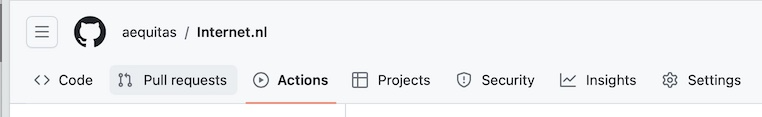
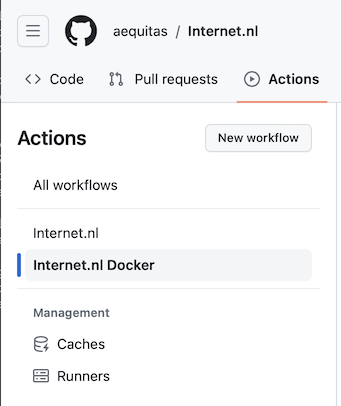
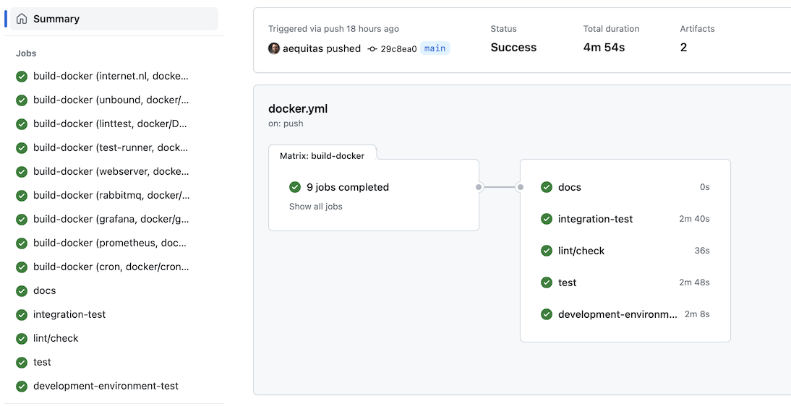
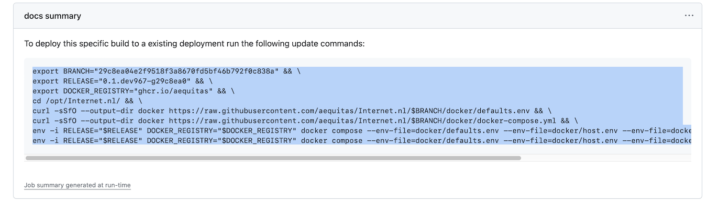
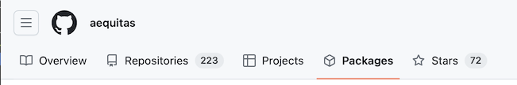

# Deploying from a forked repository

If you want to run on a modified version of the codebase it is possible to fork the repository and build your own Docker images for deployment.

For this, first fork the repository to your own Github account using the "Fork" option at the top of the main repository page or using this [link](https://github.com/internetstandards/Internet.nl/fork).

Make sure the repository has "Github Actions" enabled, as it is required to automatically build images. Github Actions should be enabled by default, but if not verify your settings: https://docs.github.com/en/repositories/managing-your-repositorys-settings-and-features/enabling-features-for-your-repository/managing-github-actions-settings-for-a-repository

After the forked repository is created a build should automatically start on the `main` branch. You can view the progress by visiting the 'Actions' page on the repository:

In the left sidebar select the "Internet.nl Docker" workflow:

From the list on the right select the latest entry at the top for the `main` branch.

You are now on the "build summary" page. Everything should be green before proceding. If not wait until the build is complete:

If this is the first time you deploy an Internet.nl instance please first run the normal installation producure as per the deployment documentation: [Deployment](Docker-deployment.md).

After this deployment is finished and verified you can proceed to deploy with your own build images.

This is very much like updating an existing deployment using the [Deployment#Updating](Docker-deployment.md#updating) section. But instead of those commands use the commands in the "docs summary" entry on the "build summary" page:

You may need to refresh the "build summary" page for the "docs summary" entry to show if you have been waiting on the build to complete.

After this command completes your installation should be running on your own version of the codebase.

## Docker images

The Docker images that are build will be placed in the [Github Container Registry](https://docs.github.com/en/packages/working-with-a-github-packages-registry/working-with-the-container-registry) of your Github Account. You can view them by going to your account and clicking the "Packages" tab:

