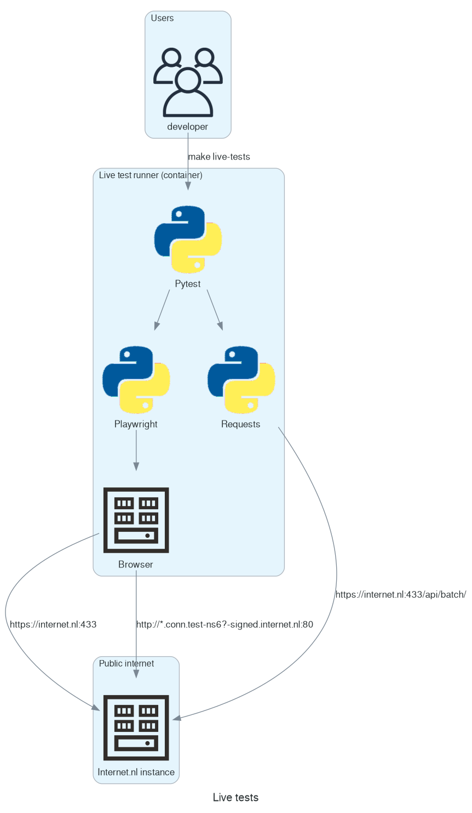

# Live tests

Besides the [Integration tests](Docker-integration-tests.md) suite there is also the Live tests suite. This suite is similar to the integration tests but runs against deployed instances running locally or on the internet. It is less intended as a development aid and more as a smoketest to verify if a deployed installation is working as expected.

## Overview

### Test runner

Test are run by the `test-runner-live` which spawns as a container with public internet access. The test runner runs tests from the `integration_tests/live/` directory. Test are run using a built-in headless browser (default: Chrome, available: Firefox, Webkit) controlled by [Playwright](https://playwright.dev/python/) or directly using the Requests library (eg: for Batch tests). The browser tests allow for testing the full stack including HTML, CSS and JavaScript components of the application.

## Setup

For requirements and setup of the development environment please first refer to the [Getting started](Docker-getting-started.md) document.

## Running tests

To run the live test suite use the following command:

    make live-tests

By default some tests will be skipped, for example due to limitations of the environment (missing IPv6), or required information (eg: Batch API authentication).

It is also possible to run the live tests suite without checkout out the source and building the test image, for this run:

    APP_URL=https://example.com
    docker pull ghcr.io/internetstandards/test-runner && \
    docker run -ti --rm --env=APP_URLS=$APP_URL ghcr.io/internetstandards/test-runner

Note that if IPv6 is not enabled in your environment some IPv6 related "Test your connection" tests are skipped.

### Specifying test targets and test instance

The live test suite can run against multiple instances (an Internet.nl website) and multiple targets (a site which is tested for conforming to the standards). Use the `APP_URLS`, `TEST_DOMAINS` and `TEST_EMAILS` to override the defaults (`https://internet.nl`). For example:

    APP_URLS=https://example.com TEST_DOMAINS=https://example.nl make live-tests

`APP_URLS`: is a comma separated list of HTTP(S) endpoints of Internet.nl instances
`TEST_DOMAINS`: is a comma separated list of domain names to run the "Test your website" test against
`TEST_EMAILS`: is a comma separated list of domain names to run the "Test your email" test against, this defaults to `TEST_DOMAINS`

Additionally you can specify the `BATCH_API_AUTH` variable as a `user:password` pair to enable testing the Batch API. This might be combined with a test selector to limit to Batch tests only, as these installations don't have working `Test your connection` tests:

    BATCH_API_AUTH=user:password APP_URLS=https://example.com TEST_DOMAINS=example.com,example.nl make live-tests test_args=-kbatch

For more information about test selectors and how to invoke the test command see: [Integration Tests#tips-and-tricks](https://github.com/internetstandards/Internet.nl/blob/docker/documentation/Docker-integration-tests.md#tips-and-tricks)

### IPv6 testing

Some tests have a different score depending on the availability of IPv6 networking (indicated by the `_with_ipv6` or `_no_ipv6` suffix). These can be seen as `skipped` in the test output. The header line `ipv6_available: True` will indicate if the test runner was able to establish IPv6 connectivity.

If you run your test on a Linux workstation/server with native IPv6 you should make sure the `iptables` and `experimental` options in the `/etc/docker/daemon.json` file are set to `true`.

    $ cat /etc/docker/daemon.json
    {"experimental": true, "ip6tables": true}

And restart your Docker daemon afterwards:

    systemctl stop docker; systemctl start docker;

