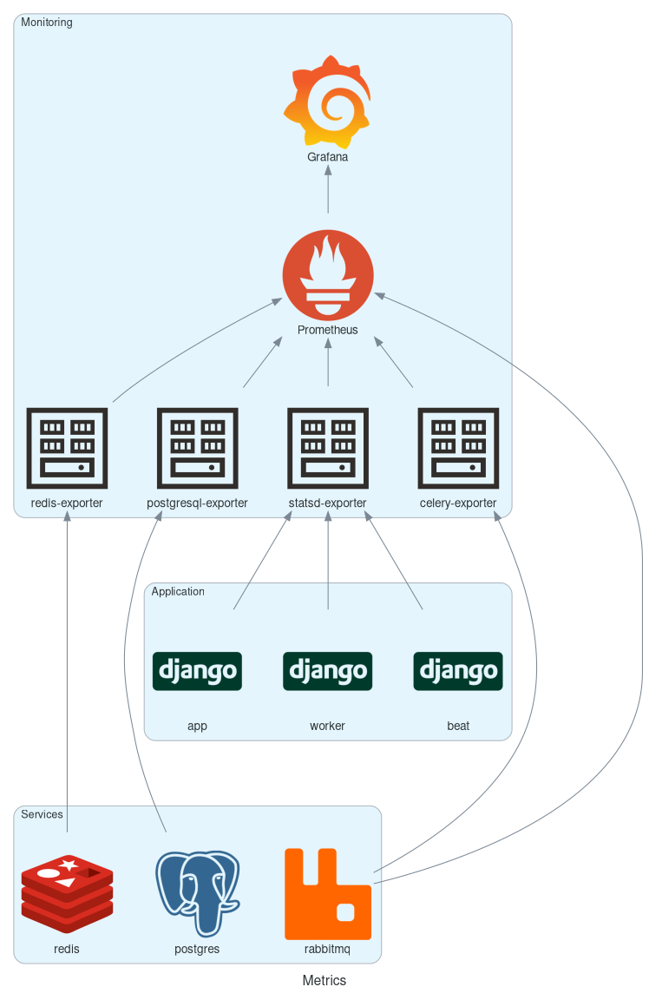

# Metrics

The Docker deployment includes a metrics collection system which is available on production as well as development/test environments. It consists of a Prometheus metrics server which scrapes metrics from various exporters. Grafana is provided as frontend to visualise metrics and create graphs/dashboards.

To view metrics and graphs visit the `/grafana/` endpoint. Eg: `http://localhost:8080/grafana/` for development and `https://example.com/grafana/` for production. For development the user/password is set to `test/test`, for production users can be configured using the `MONITORING_AUTH_RAW` variable in `docker/local.env` (see `docker/defaults.env` for information).

Metrics collection is defined in the `docker/docker-compose-monitoring.yml` file.

## Overview

## Missing metrics

If metrics seem absent, first check Prometheus targets to see if all exporters can be scraped: https://example.com/prometheus/targets

Check if the exporter containers are running: `make ps`

You can scrape the exporters themselves and see what metrics they return using eg:

     make exec service=grafana cmd="curl http://celery-exporter:9808/metrics" env=develop

The Grafana service is used because Prometheus does not include curl. The URL's can be taken from the Prometheus targets overview.

## Adding dashboards

**notice**: Please note that Grafana (and the rest of the monitoring containers) are not connected to the public interface and don't have internet access. So adding Dashboards via "Import via grafana.com" does not work. Dashboard from grafana.com can be imported using the JSON model.

Dashboard can be manually created through the Grafana web interface and can be saved there. Existing Dashboard cannot be modified this way as they are provisioned from the Docker image. Either duplicate the Dashboard with your own modifications or export the Dashboard JSON Model and update the files at: https://github.com/internetstandards/Internet.nl/tree/docker/docker/monitoring/grafana/dashboards