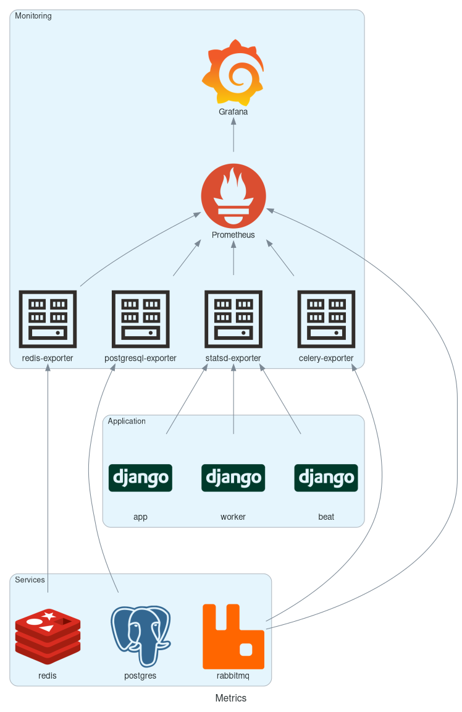

# Metrics

The Docker deployment includes a metrics collection system which is available on production as well as development/test environments. It consists of a Prometheus metrics server which scrapes metrics from various exporters. Grafana is provided as frontend to visualise metrics and create graphs/dashboards.

To view metrics and graphs visit the `/grafana/` endpoint. Eg: `http://localhost:8080/grafana/` for development and `https://example.com/grafana/` for production. For development the user/password is set to `test/test`, for production users can be configured using the `/opt/Internet.nl/volumes/webserver/htpasswd/monitoring.htpasswd` file, see below for information.

## Overview

## Missing metrics

If metrics seem absent, first check Prometheus targets to see if all exporters can be scraped: https://example.com/prometheus/targets

Check if the exporter containers are running: `make ps`

You can scrape the exporters themselves and see what metrics they return using eg:

     make exec service=grafana cmd="curl http://celery-exporter:9808/metrics" env=develop

The Grafana service is used because Prometheus does not include curl. The URL's can be taken from the Prometheus targets overview.

## Adding dashboards

**notice**: Please note that Grafana (and the rest of the monitoring containers) are not connected to the public interface and don't have internet access. So adding Dashboards via "Import via grafana.com" does not work. Dashboard from grafana.com can be imported using the JSON model.

Dashboard can be manually created through the Grafana web interface and can be saved there. Existing Dashboard cannot be modified this way as they are provisioned from the Docker image. Either duplicate the Dashboard with your own modifications or export the Dashboard JSON Model and update the files at: https://github.com/internetstandards/Internet.nl/tree/docker/docker/monitoring/grafana/dashboards

## Retention time

By default metrics are retained for 5 years. This can be changed by settings the `PROMETHEUS_RETENTION_TIME` in the `docker/local.env` file. Optionally you can also set the `PROMETHEUS_RETENTION_SIZE` to limit the disk space used.

## Monitoring user/allowlist management

Monitoring endpoints are IP/password restricted. To allow users to visit these pages credentials or allowlists must be configured.

Set `ALLOW_LIST` in `/opt/Internet.nl/docker/local.env` to allow certain IP's to access the monitoring without authentication, eg: `ALLOW_LIST=198.51.100.1,2001:db8:2::1`

Add `user:passwordhash` entries to `/opt/Internet.nl/volumes/webserver/htpasswd/monitoring.htpasswd`. These should be Apache2 htpassword hashes. To add or update a user password run:

    /opt/Internet.nl/docker/compose.sh exec webserver htpasswd /etc/nginx/htpasswd/monitoring.htpasswd username

You will be prompted to enter the password.

After updating `ALLOW_LIST` or changing users update the configuration by running: `/opt/Internet.nl/docker/compose.sh restart webserver`.
